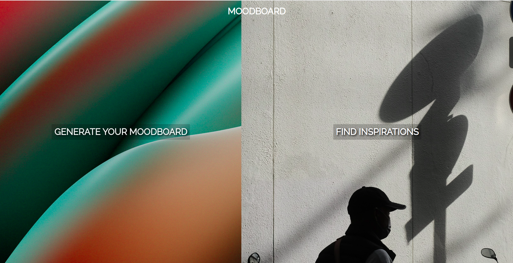
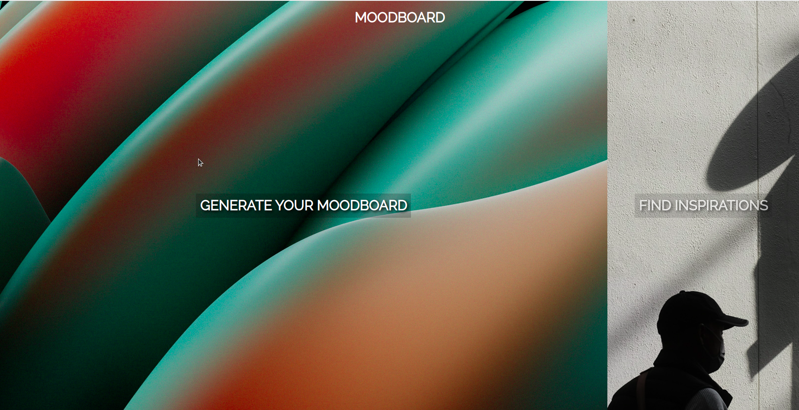
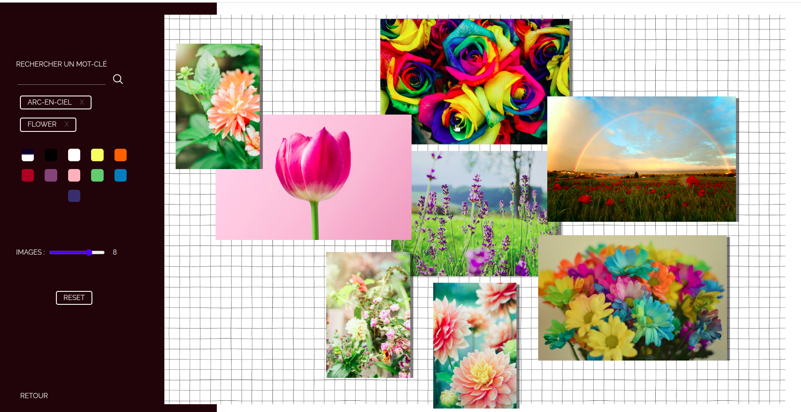
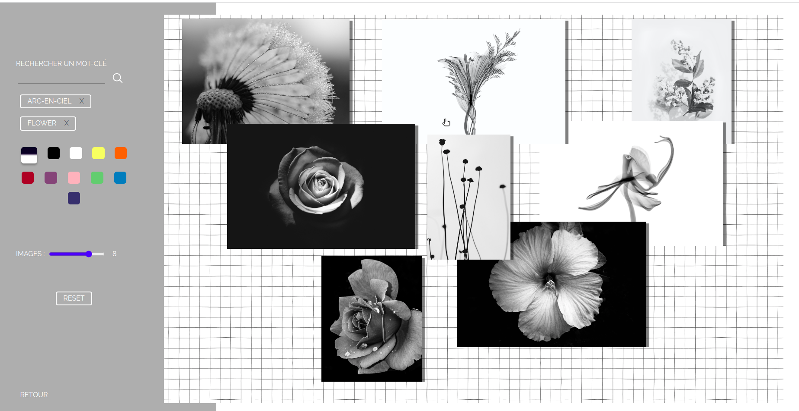
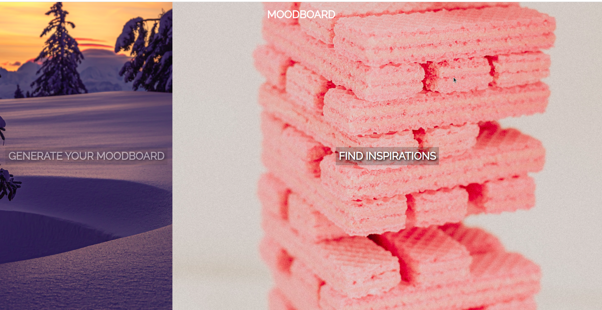
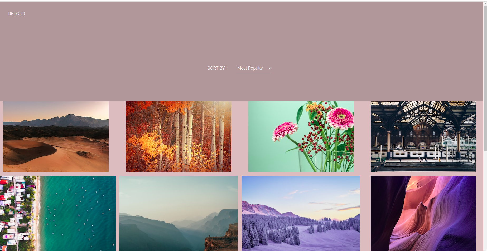

# projet_web - MoodBoard

## Project setup
```
npm install
```

### Compiles and hot-reloads for development  45
```
npm run serve
```

### Compiles and minifies for production
```
npm run build
```

### Lints and fixes files
```
npm run lint
```

### Customize configuration
See [Configuration Reference](https://cli.vuejs.org/config/).


/// key = 25718814-a88fd70942551b0435abcc629

### How to navigate on MoodBoard ?



When landing on the homepage, you have to choose between two options : you click either at the left side of the window to 'Generate your MoodBoard' with keywords and with the possibility to sort images by colors and by numbers, 
either you click on the right side to 'Find Inspirations' by scrolling through an (almost) infinite list of images in order for you to find inspirations and ideas to create your own MoodBoard.



To the right side...


create your moodboard through keywords and arrange the images as you want...


or through colors to give a complete different atmosphere.



To the left side ...


discover a infinite list of inspirational images.
